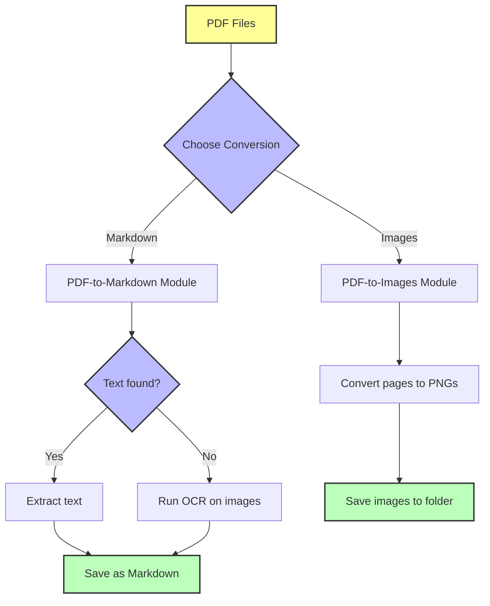
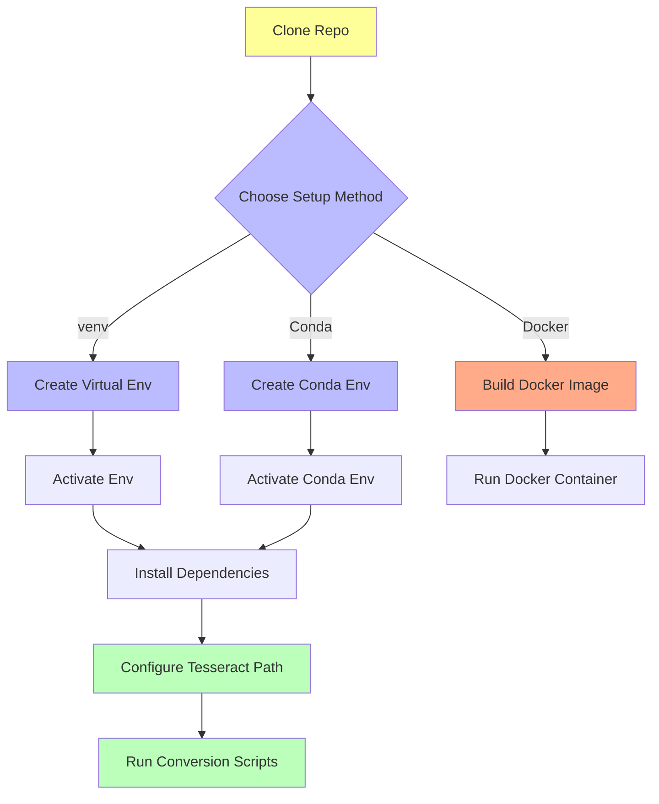

# 🗂️ **Document Format Converters** — *Your Beginner-Friendly PDF Toolkit*

[](LICENSE)


---

## ✨ What is Document Format Converters?

A **zero-cost, beginner-friendly toolkit** to turn your PDFs into **images** or **Markdown text** — even if they’re scanned or image-only!

- **Extract slides or pages as images** for presentations, annotation, or archiving.
- **Convert PDFs to editable Markdown**, with **automatic OCR fallback** if the PDF has no embedded text.
- Designed for **clueless coders, prompt engineers, students, and casual contributors** who want **fast, no-fuss document conversion**.

Think of it as your **Swiss Army knife** for PDFs — no coding degree required.

---

## 🧰 Tech Stack Overview

| Area            | Technologies & Libraries                                         |
|-----------------|------------------------------------------------------------------|
| **Language**    | Python 3.8+                                                      |
| **PDF to Images** | `PyMuPDF`, `pdf2image`, `tqdm`, `logging`                      |
| **PDF to Markdown** | `pdfplumber`, `pytesseract`, `pdf2image`, `Pillow`           |
| **OCR Engine**  | [Tesseract OCR](https://github.com/tesseract-ocr/tesseract)      |
| **CLI/Script**  | Pure Python scripts                                              |

*No databases, no cloud APIs, no complex infrastructure.*

---

## 🌱 Why This Fork?

- **Batch processing**: Convert entire folders, not just single files.
- **OCR fallback**: Extracts text even from scanned PDFs.
- **Cleaner, friendlier docs**: For beginners and non-coders.
- **Multiple conversion methods**: Choose between fast or high-quality.
- **Ready to extend**: Modular Python code.

---

## 🚀 Key Features

- **PDF to Images**:
  - Convert PDFs into high-resolution PNGs.
  - Supports grayscale for better OCR.
  - Batch convert multiple PDFs.
  - Two methods: `PyMuPDF` (fast) and `pdf2image` (high quality).
- **PDF to Markdown**:
  - Extracts text from PDFs.
  - Falls back to OCR if no text found.
  - Saves clean, editable Markdown files.
- **Beginner-friendly setup** with clear instructions.
- **Cross-platform**: Windows, Linux, macOS.

<details>
<summary>📁 <strong>Project Structure</strong></summary>

````plaintext
Document-Format-Converters/
├── PDF-to-Images/
│   ├── pdf_to_images.py                  # Batch converter using pdf2image
│   ├── pdf to images using PyMuPDF.py    # Simple script, hardcoded path
│   ├── Input-Files/                      # Put your PDFs here
│   └── Output-Images/                    # Converted images saved here
├── PDF-to-Markdown/
│   └── pdf_to_markdown.py                # PDF to Markdown with OCR fallback
├── requirements.txt                      # Python dependencies
├── README.md                             # This file
└── .README-instructions.md               # Expert instructions
````

</details>

---

## ⚙️ How It Works

### Step-by-step

1. **Place your PDFs** in the `Input-Files/` folder (for images) or specify path (for Markdown).
2. **Run the script**:
   - For images: convert all PDFs to PNGs.
   - For Markdown: extract text, or OCR if needed.
3. **Get your output**:
   - Images saved in `Output-Images/`.
   - Markdown saved alongside your PDF.

### 🖼️ + 📝 = 💡

---

### 🔄 Conversion Flow Diagram



---

## 🛠️ Prerequisites

- **Python 3.8+**  
  [Download Python](https://www.python.org/downloads/)

- **Tesseract OCR** (for scanned PDFs)  
  [Download Tesseract](https://github.com/tesseract-ocr/tesseract)  
  *Make sure to note the install path (e.g., `C:\Program Files\Tesseract-OCR\tesseract.exe`).*

- **Python packages** (see `requirements.txt`):  
  `fitz` (PyMuPDF), `pdf2image`, `pdfplumber`, `pytesseract`, `Pillow`, `tqdm`, `logging`

---

## ⚡ Setup Options (Choose One)

### 🥇 Option 1: Virtual Environment (Recommended)

```bash
# Clone the repo
git clone <repo-url>
cd Document-Format-Converters

# Create and activate virtual environment
python -m venv venv
venv\Scripts\activate  # On Windows
# or
source venv/bin/activate  # On macOS/Linux

# Install dependencies
pip install -r requirements.txt
```

### 🥈 Option 2: Conda Environment

```bash
conda create -n doc-convert python=3.8
conda activate doc-convert
pip install -r requirements.txt
```

### 🐳 Option 3: Docker (Advanced Users)

> ⚠️ *Docker is optional and may be tricky for beginners.*

- Ensure [Docker Desktop](https://www.docker.com/products/docker-desktop) is installed.
- Build and run:

```bash
docker build -t doc-convert .
docker run -v "$(pwd)/Input-Files":/app/Input-Files -v "$(pwd)/Output-Images":/app/Output-Images doc-convert
```

---

## 🧭 Visual Setup Guide



---

## ▶️ Running the Tools

### Convert PDFs to Images (Batch)

```bash
cd PDF-to-Images
python pdf_to_images.py
```

- Place PDFs in `Input-Files/`
- Images saved in `Output-Images/`

### Convert a PDF to Markdown

```bash
cd PDF-to-Markdown
python pdf_to_markdown.py
```

- Enter the path to your PDF when prompted.
- Markdown saved next to your PDF.

### Alternative: Quick Single PDF to Images (PyMuPDF)

- Edit `pdf to images using PyMuPDF.py` to set your PDF path.
- Run:

```bash
python "pdf to images using PyMuPDF.py"
```

---

## 🔑 Configuration Notes

- **Tesseract Path**:  
  If using Windows, ensure this line in `pdf_to_markdown.py` points to your install:

```python
pytesseract.pytesseract.tesseract_cmd = r"C:\Program Files\Tesseract-OCR\tesseract.exe"
```

- **No API keys required!**  
  All processing is local.

---

## 📈 Status & Roadmap

- ✅ Batch PDF to images conversion
- ✅ PDF to Markdown with OCR fallback
- ✅ Beginner-friendly instructions
- ⏳ Optional Docker support
- 🔜 GUI wrapper for easier use
- ⚠️ Known: OCR accuracy depends on scan quality

---

## 🤖 How AI Helped

- This README and parts of the code were **co-created with AI assistance**.
- AI helped design the **OCR fallback logic** and **improve beginner guidance**.
- Encourages you to **use AI tools** for your own coding journey!

---

## 📜 License

This project is licensed under the [MIT License](LICENSE).

---

## 💬 Community & Support

- **New to coding?** You’re welcome here!
- **Questions or issues?** Open an issue or discussion on the repo.
- **Want to contribute?** PRs and suggestions encouraged.
- **Let’s make document conversion easy for everyone!**

---
