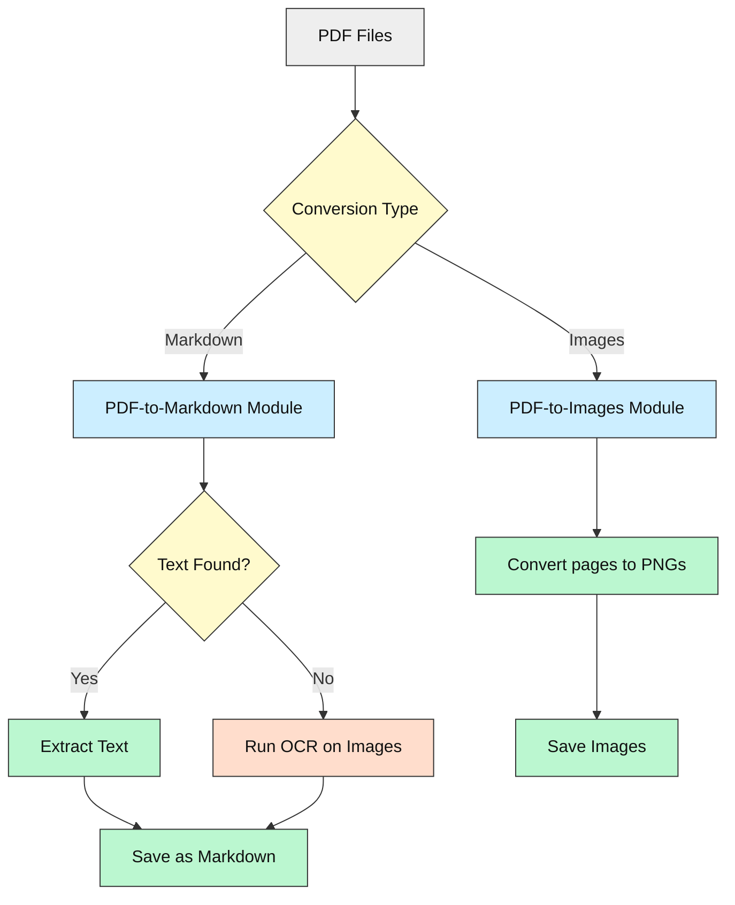
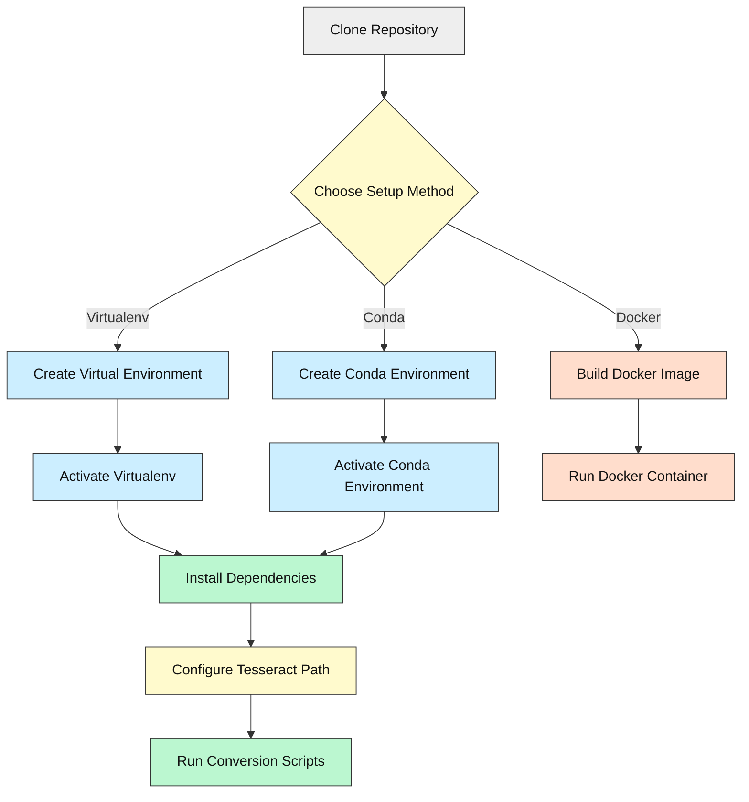

# 🗂️ **PDF Converter Toolkit** — *Turn PDFs into Images or Markdown with Ease*

[](LICENSE)


---

## ✨ What & Why

**Convert any PDF into high-quality images or clean, editable Markdown — even if it's just a scanned document.**

Are you a prompt engineer, student, researcher, or beginner coder who wants to **extract slides, notes, or text from PDFs** without complex tools? This toolkit:

- **Converts PDFs into crisp images** for annotation, presentations, or archiving.
- **Extracts text into Markdown**, with **automatic OCR fallback** for scanned pages.
- Works **entirely offline** — no cloud, no API keys.
- Designed for **clueless coders** — so you can focus on your content, not the code.

Think of it as your **Swiss Army knife for PDFs** — simple, powerful, and beginner-friendly.

---

## 🧰 Tech Stack Overview

| Area               | Technologies & Libraries                                         | Minimum Version / Notes                     |
|--------------------|------------------------------------------------------------------|--------------------------------------------|
| **Language**       | Python                                                          | 3.11+                                      |
| **PDF to Images**  | `pdf2image`, `PyMuPDF (fitz)`, `tqdm`, `logging`                | Batch + fast conversion                    |
| **PDF to Markdown**| `pdfplumber`, `pytesseract`, `pdf2image`, `Pillow`              | Text extraction + OCR fallback             |
| **OCR Engine**     | [Tesseract OCR](https://github.com/tesseract-ocr/tesseract)     | Installed locally                          |
| **Infrastructure** | Pure Python scripts                                              | No databases, no cloud, no APIs            |

*Runs on Windows, Linux, macOS.*

---

## 🚀 Key Features

- **PDF to Images:**
  - Batch convert multiple PDFs.
  - High-resolution PNG output, grayscale optimized for OCR.
  - Two methods:
    - **PyMuPDF**: fast, simple (edit file path manually).
    - **pdf2image**: higher quality, batch, with progress bar.
- **PDF to Markdown:**
  - Extracts embedded text.
  - Falls back to OCR if no text found.
  - Saves clean, editable Markdown files.
- **Cross-platform:** Windows, Linux, macOS.
- **No API keys or cloud required.**
- **Beginner-friendly setup** with multiple options.

---

## 🧩 How It Works — System Overview

### Step-by-step

1. **Input:** Provide your PDF file(s).
2. **Choose conversion:**
   - **Images:** Convert all pages to PNG images.
   - **Markdown:** Extract text, or OCR if no text found.
3. **Processing:**
   - For images: convert each page to a high-res PNG.
   - For Markdown: extract text or run OCR on page images.
4. **Output:**
   - Images saved as PNG files.
   - Markdown saved as `.md` files.

### Conversion Flow Diagram



---

## 🛠️ Prerequisites

- **Python 3.11+**  
  [Download Python](https://www.python.org/downloads/)

- **Tesseract OCR** (for scanned PDFs)  
  [Download Tesseract](https://github.com/tesseract-ocr/tesseract)  
  *Note the install path (e.g., `C:\Program Files\Tesseract-OCR\tesseract.exe`).*

- **Python packages:**  
  `fitz` (PyMuPDF), `pdf2image`, `pdfplumber`, `pytesseract`, `Pillow`, `tqdm`, `logging`  
  *(Install via `requirements.txt`)*

- **No API keys required!**  
  All processing is local and offline.

---

## ⚡ Setup — Multiple Clear Paths

> You should get this running in **~15 minutes**. Choose one option:

### 🥇 Option 1: Virtual Environment (Recommended for Beginners)

```bash
git clone <repo-url>
cd Document-Format-Converters

python -m venv venv
# Activate:
venv\Scripts\activate        # On Windows
# or
source venv/bin/activate     # On macOS/Linux

pip install -r requirements.txt
```

### 🥈 Option 2: Conda Environment

```bash
conda create -n pdfconvert python=3.11
conda activate pdfconvert
pip install -r requirements.txt
```

### 🐳 Option 3: Docker (Optional, Not Recommended for Beginners)

> ⚠️ Docker setup is optional and may be tricky for newcomers.

- Install [Docker Desktop](https://www.docker.com/products/docker-desktop)
- Build and run:

```bash
docker build -t pdfconvert .
docker run pdfconvert
```

---

## 🧭 Visual Setup Guide



---

## ▶️ Running the Project

### Convert PDFs to Images (Batch Mode)

```bash
cd PDF-to-Images
python pdf_to_images.py
```

### Convert a PDF to Markdown

```bash
cd PDF-to-Markdown
python pdf_to_markdown.py
```

- Enter the path to your PDF when prompted.

### Quick Single PDF to Images (PyMuPDF)

- Edit `pdf to images using PyMuPDF.py` to set your PDF path.
- Run:

```bash
python "pdf to images using PyMuPDF.py"
```

---

## 🔑 Configuration & API Keys

- **Tesseract Path:**  
  In `pdf_to_markdown.py`, ensure this line points to your install:

```python
pytesseract.pytesseract.tesseract_cmd = r"C:\Program Files\Tesseract-OCR\tesseract.exe"
```

- **No API keys needed!**  
  Everything runs locally.

---

## 📈 Status & Roadmap

- ✅ Batch PDF to images conversion
- ✅ PDF to Markdown with OCR fallback
- ✅ Beginner-friendly instructions
- ⏳ Optional Docker support
- 🔜 GUI wrapper for easier use
- ⚠️ Known: OCR accuracy depends on scan quality

---

## 🤖 How AI Helped

- This README and parts of the code were **co-created with AI assistance**.
- AI helped design the **OCR fallback logic** and **improve beginner guidance**.
- Encourages you to **use AI tools** for your own coding journey!

---

## 📜 License & Attribution

This project is licensed under the [MIT License](LICENSE).  
Originally based on open-source PDF conversion scripts, improved for beginners.

---

## 💬 Community & Support

- **New to coding?** You’re welcome here!
- **Questions or issues?** Open an issue or discussion on the repo.
- **Want to contribute?** PRs and suggestions encouraged.
- **Let’s make document conversion easy for everyone!**

---
