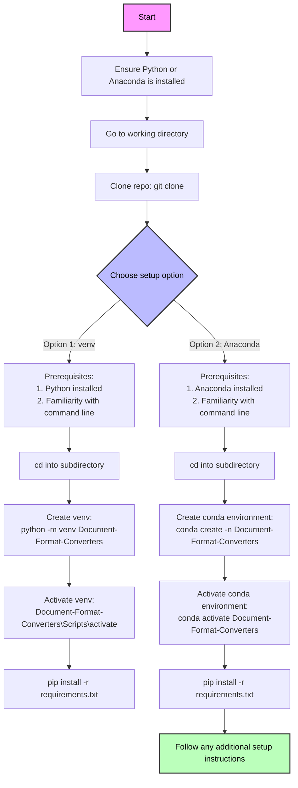

# Document Format Converters

### 1. Introduction
- **Purpose**: This repository provides tools for converting various document formats, making it easier for users to manage and manipulate their documents.
- **Target Audience**: Aimed at users with little to no coding experience.

### 2. Reasons for Fork/Contribution
- Improvements include enhanced conversion accuracy, support for additional formats, and clearer documentation.

### 3. Prerequisites
- Necessary tools:
  - Python 3.8 or higher
  - Required libraries (listed in `requirements.txt`)
- Installation links:
  - [Python Download](https://www.python.org/downloads/)

### 4. Quick Start Guide
- **Time Limit**: If you cannot get started within 15 minutes, consider using an online conversion service.
- **Setup Options**:
  - **Option 1**: Using `venv`
    - Create a virtual environment: `python -m venv Document-Format-Converters`
    - Activate it: `Document-Format-Converters\Scripts\activate`
    - Install dependencies: `pip install -r requirements.txt`
  - **Option 2**: Using Anaconda
    - Create a virtual environment: `conda create -n Document-Format-Converters`
    - Activate it: `conda activate Document-Format-Converters`
    - Install dependencies: `pip install -r requirements.txt`

### 5. Important Notices
- Ensure that the `config.json` file is properly set up for default settings.

### 6. Visual Aid

### 7. Running the Code
- To run the application, use the command: `python app.py` after setting up your environment.

### 8. Setting API Keys (if applicable)
- If API keys are required, please refer to the `config.json` file for configuration instructions.

### Conclusion
- **CALL TO ACTION**: We encourage users to provide feedback or ask questions as they work through the repository, fostering a supportive community around the project.