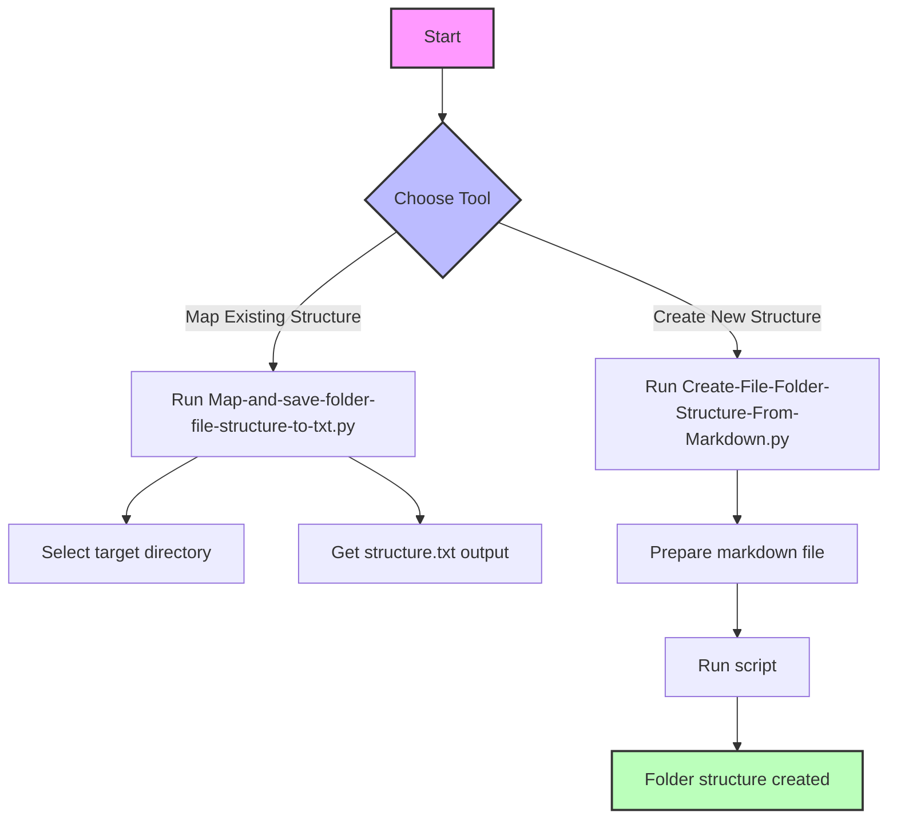

# File and Folder Structure Utilities

## 1. Introduction
- **Purpose**: This repository contains Python utilities for managing and creating file/folder structures. It provides tools to both map existing directory structures and create new ones from markdown specifications.
- **Target Audience**: This toolkit is designed for users with little to no coding experience who need to manage file organization systematically.

## 2. Reasons for Creation
These tools address common file organization challenges by:
- Automating folder structure creation from markdown specifications
- Providing easy-to-use mapping tools for documenting existing directory structures
- Eliminating manual folder creation errors

## 3. Prerequisites
- Python 3.6 or higher
- No additional external dependencies required
- Basic understanding of markdown format (for structure creation)

Download Python: [Python Official Website](https://www.python.org/downloads/)

## 4. Quick Start Guide
The repository contains two main utilities that can be set up in under 5 minutes.

### Option 1: Using Python directly
1. Clone or download this repository
2. Open a terminal in the project directory
3. No virtual environment is required as these scripts use standard Python libraries

## 5. Important Notices
- The markdown file for structure creation should follow a specific format (see example below)
- Output files will be created in the same directory as the scripts
- Both scripts are standalone and don't require additional configuration

## 6. Visual Guide



## 7. Running the Code

### To Map Existing Structure:
```bash
python Map-and-save-folder-file-structure-to-txt.py
```
This will create a text file documenting your folder structure.

### To Create Structure from Markdown:
```bash
python Create-File-Folder-Structure-From-Markdown.py
```
Follow the prompts to specify your markdown file.

### Example Markdown Structure Format:
```markdown
# Root Folder
## Subfolder1
- file1.txt
- file2.py
## Subfolder2
### SubSubFolder
- file3.md
```

## 8. Setting API Keys
No API keys are required for these utilities.

## Need Help?
If you encounter any issues or have questions about using these tools, please:
1. Check the script comments for detailed usage instructions
2. Open an issue in the repository
3. Reach out to the maintainers for support

Your feedback helps make these tools more accessible to everyone!