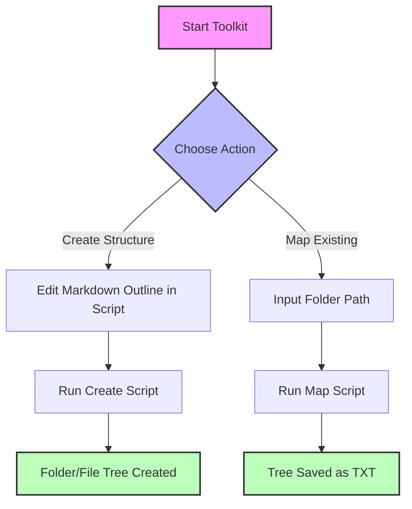
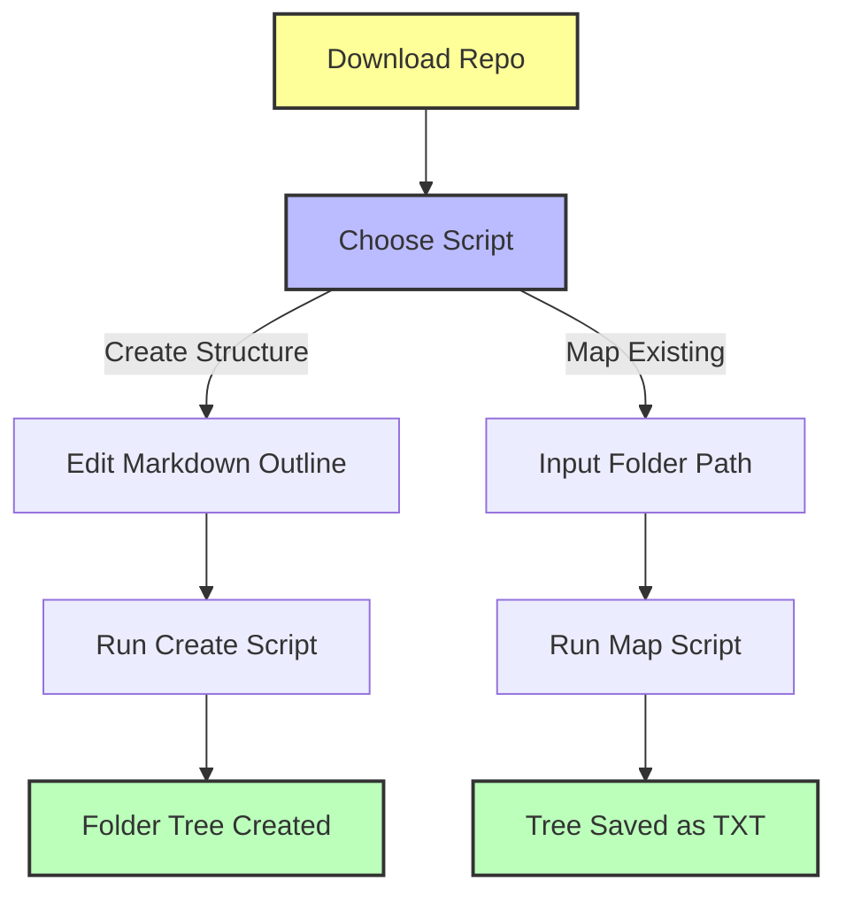

# 🗂️ Clueless Coders' File & Folder Structure Toolkit  
**Effortlessly map, document, and create directory trees — no coding expertise needed!**

[](LICENSE)  
  
  
  


---

## 🌟 What is this Toolkit? Why use it?

Are you tired of **manually creating complex folder structures** or **documenting messy directories**?  
This beginner-friendly toolkit **automates** those boring, error-prone tasks:

- **Turn a simple text outline into real folders & files** in seconds.
- **Map any existing directory** into a clean, shareable text tree.

Perfect for **prompt engineers, students, hobbyists, or anyone** who wants to organize projects **without deep coding skills**.

---

## 🧰 Tech Stack Overview

| Area            | Details                                         |
|-----------------|-------------------------------------------------|
| **Language**    | Python 3.6+ (standard library only)             |
| **Dependencies**| None (pure Python, no installs needed)          |
| **Platforms**   | Windows, Linux, macOS                           |
| **Scripts**     | `Create-File-Folder-Structure-From-Markdown.py`<br>`Map-and-save-folder-file-structure-to-txt.py` |

---

## ✨ Key Features

- **Create** complex folder/file structures from a markdown-style outline.
- **Map & save** any existing directory tree to a text file.
- **Zero dependencies** — works out of the box with Python.
- **No setup headaches** — just run the scripts.
- **Beginner-friendly** — designed for non-coders.
- **Cross-platform** — works on Windows, Linux, and macOS.

<details>
<summary>📂 Example Project Structure (created or mapped)</summary>

```
ProjectRoot/
├── README.md
├── package.json
├── src/
│   ├── app.js
│   └── utils.js
├── assets/
│   ├── images/
│   │   └── logo.png
│   └── styles/
│       └── main.css
└── docs/
    └── user-guide.docx
```
</details>

---

## ⚙️ How It Works

### 1. **Create from Markdown Outline**

- You **edit a markdown-style tree** inside the script (or adapt it to load from a file).
- The script **parses indentation and symbols** to understand folders vs. files.
- It **creates all folders and empty files** matching the outline.

### 2. **Map Existing Folder**

- You **input a folder path**.
- The script **walks through all subfolders/files**.
- It **saves a pretty tree diagram** as a `.txt` file.

---

## 🔄 Workflow Diagram



---

## 🖥️ Prerequisites

- **Python 3.6 or newer**  
  [Download Python here](https://www.python.org/downloads/)

_No other tools, packages, or accounts needed!_

---

## 🚀 Setup & Usage Options

### Option 1: Quick Start (Recommended)

1. **Download or clone** this repository.
2. **Open a terminal** (Command Prompt, PowerShell, Terminal app).
3. **Navigate** to the folder with the scripts.

_No virtual environment needed — pure Python!_

### Option 2: (Optional) Virtual Environment

For isolation:

```bash
python -m venv venv
# Activate:
# Windows:
venv\Scripts\activate
# macOS/Linux:
source venv/bin/activate

# No packages to install, but good practice!
```

---

## 🗺️ Visual Setup Guide



---

## 🏃 Running the Scripts

### To **Create a Folder/File Structure** from Markdown:

1. **Open `Create-File-Folder-Structure-From-Markdown.py`** in any text editor.
2. **Edit the `base_path`** variable to your desired root folder location.
3. **Modify the `markdown_structure`** variable with your desired tree (see example inside script).
4. **Run:**

```bash
python Create-File-Folder-Structure-From-Markdown.py
```

Your folder and file tree will be created automatically!

---

### To **Map an Existing Folder Structure**:

1. **Run:**

```bash
python Map-and-save-folder-file-structure-to-txt.py
```

2. **When prompted, enter the full path** to the folder you want to map.

3. The script will generate a `folder_structure.txt` file showing the entire tree.

---

## 🗝️ Configuration & API Keys

- **No API keys or config files needed.**
- Just edit the variables **inside the scripts** as needed.

---

## 🚦 Project Status & Roadmap

- ✅ Fully working: create from markdown & map existing folders.
- ⏳ Planned:  
  - Load markdown from external `.md` file.  
  - GUI version for even easier use.  
  - Export to other formats (JSON, CSV).  
  - Drag-and-drop web interface.

---

## 🤖 How AI Helped

This README and toolkit were **reviewed and improved with AI assistance** to ensure clarity and beginner-friendliness.

---

## 📜 License

[MIT License](LICENSE) — free to use, modify, and share.

---

## 💬 Community & Support

- **New to coding?** Don’t worry — these tools are for you!
- **Questions or ideas?** Open an issue or pull request.
- **Feedback welcome** to make this even more beginner-friendly.

---

# 🎉 Happy Organizing!  
_Empower your projects with clean, automated folder structures._
