# Expert Instructions for LLM
## Generate a Beginner-Friendly, Insightful, and Actionable README.md


## Guiding Principles

- Target audience **"clueless coders"**: natural language prompt engineers, coding newcomers, vibe coders or casual contributors.
- Write with **clarity, empathy**, and accessible language.
- Combine **motivation, explanation, and actionable instructions.**
- Visually rich—**use badges, flowcharts, diagrams wherever helpful**. When creating Mermaid diagrams, **prefer darker colors for shapes to ensure sufficient contrast**.
- Surface all **prerequisite knowledge early**, minimizing surprises.
- Provide **multiple setup paths**; warn explicitly about tricky parts.
- Help users understand **what the repo does, why it exists, and how it fits together**.
- Encourage interactivity and confidence.

---

## Required Sections and Content (Ordered)

---

### 1. Title & Badges

- **Catchy project name and subtitle** in bold.
- **License badge** prominently.
- **Language/runtime versions** badges: e.g., Python 3.11+, Node.js v20+
- **Supported OS badges:** Windows, Linux, macOS.
- **Build/Test status** badges (GitHub Actions, etc.)
  
*Example:*  
  
`[] [] [] []`

---

### 2. Project Purpose ("What & Why")

- **One or two short paragraphs** answering:
  - What problem does this project solve?
  - Who benefits, who is it made for?
  - Why is this interesting or important?
- Use **plain language analogies** or simple explanations.

---

### 3. Tech Stack Overview (ALWAYS near the top)

- Quick **bullet list or table** stating:
  - Languages and frameworks used
  - Databases or storage
  - Infrastructure/services
  - AI models or APIs
- Clarify **minimum programming/runtime versions**.

*→ So beginners immediately judge compatibility*

---

### 4. Fork/Improvement Information (if applicable)

- Is this a **fork or contribution**?
- Clearly state **what’s different**—e.g., simplified install, frozen dependencies, more docs.
- Encourage users why they should pick THIS repo.

---

### 5. Key Features List

- Clear, **bulleted enumeration** of what the project does:
  - Core features
  - Notable integrations
  - Unique aspects
- Optionally add a **file structure code block** or Mermaid chart showing folder layout. When using Mermaid, **use darker colors for shapes**.

---

### 6. How It Works → System Overview

- **Explain the architecture or workflow** in beginner language.
- Use both:
  - Concise **step-by-step description** (e.g., 1-4 steps)
  - A **Mermaid flowchart or diagram** of data/logic flow. When creating Mermaid diagrams, **prefer darker colors for shapes to ensure sufficient contrast**.
- Cover:
  - Inputs
  - Key processing stages
  - Outputs/display

*Diagrams create powerful clarity for all readers.*

---

### 7. Prerequisites & Accounts

- List **tools/accounts** you need _before_ setup:
  - Programming language versions
  - Package managers / CLI tools
  - External API keys with links
  - Required services (e.g., DB)
- Provide **download links** and a sentence about why the tool is needed.
- Explicitly warn if Docker is optional or problematic for beginners.

---

### 8. Setup — Multiple Clear Paths

- Emphasize: **You should get this running in ~15 minutes**. Else, suggest alternatives (e.g., web demo, notebooks).
- For each setup option **clearly labeled**:

#### Option 1: Virtual Environments (Recommended for Beginners)

- Clone commands
- How to create and activate environments (`venv`, `conda`)
- How to install dependencies (`requirements.txt`, pip install .)
- How to configure environment variables (explain why)
- How to run database migrations if any

#### Option 2: Docker (Optional, Not Recommended for Beginners)

- Pre-requisites (Docker Desktop etc.)
- Build and run commands
- Expected endpoints / ports
- Caution emoji or text noting Docker complexities

---

### 9. Visual Setup Guide

- **Mermaid flowchart or mind map** summarizing the full setup & launch process. When creating Mermaid diagrams, **use darker colors for shapes to improve readability**.
- Include visual differentiation for options
- Use **color blocks** or emojis for clarity
- *Inspired by your detailed diagram, but encourage embedding per-project diagrams*

---

### 10. Running the Project

- **Copy-paste-ready commands** for:
  - Starting the app
  - Running core functions
  - Testing basic functionality
- Prefer **minimal, beginner-proof commands.**

---

### 11. Configuration & API Keys

- Explain when/where to set API keys
- How to get them step-by-step
- How to format `.env` or config files
- Why keys are necessary

---

### 12. Status & Roadmap

- **Emoji-coded list**:
  - What works now (✅)
  - What’s WIP (⏳)
  - Known issues (⚠️)
  - Next planned features (🔜)
- Optionally invite contributors.

---

### 13. How AI Helped (if relevant)

- Acknowledge AI agent pair programming or code review.
- Share helpful anecdotes.
- Explain integrated AI features.
- Encourage others to tap AI for help.

---

### 14. License & Attribution

- Restate license explicitly.
- Link to LICENSE file.
- Attribution if a fork or derivative.

---

### 15. Community Support / Feedback

- Links to ask questions or raise issues
- Encourage comments and collaboration.
- Reassure beginners they can reach out!

---

# Summary: Synthesis Highlights

- **Put license, language, and platform badges TOPMOST.**
- **Explain “why care” clearly and early (“Presidential briefings for you”).**
- **Expose the tech stack upfront so readers can self-qualify.**
- **Bulleted features list, plus visual aid (file tree / diagram).**
- **Explain architecture in both text & Mermaid diagram**. When using Mermaid, **prefer darker colors for shapes**.
- **Prerequisites & multiple setup paths with reasons/warnings.**
- **Mermaid setup mind map to lower anxiety**. Use **darker colors for shapes** to improve readability.
- **Copy-paste run commands.**
- **Explicit API key/config guidance.**
- **Status & Roadmap—confidence and transparency.**
- **Acknowledge AI involvement to inspire and educate.**
- **Make it friendly, skimmable, motivation-rich.**

---

# Closing Tips for the LLM

- Write for **zero-overhead onboarding**.
- Use **colorful badges** and **visuals** liberally. When creating Mermaid diagrams, **ensure sufficient contrast by using darker colors for shapes**.
- **Explain WHY behind every major step**.
- Assume readers are smart and curious but possibly new to dev.
- Prioritize **clarity over brevity**—make it beginner-proof.
- Encourage exploration, questions, and feedback.

---
<example>
Certainly! Here’s an anonymized and obfuscated version of that README.md, sanitized of repo-specific names, usernames, URLs, API providers, and product branding. It still illustrates a rich, inspiring, high-quality README.md pattern, ideal for an LLM reference:

---

# ProjectName: Next-Gen Personalized Intelligence Platform

[](https://github.com/USERNAME/REPO/actions)
[](https://opensource.org/licenses/LICENSE_TYPE)


_A cutting-edge, AI-powered platform to distill signal from noise._

---

## What is ProjectName?

ProjectName acts like a virtual intelligence analyst:

- Scans **thousands of information sources daily**
- Surfaces **insights tailored just for you**
- Explains **context and significance** with expert-level AI summaries

Like a briefing for decision-makers—but in your hands, automated and personalized.

---

## Tech Stack 🧰

| Area            | Technologies                                                   |
|-----------------|----------------------------------------------------------------|
| **Frontend**    | Vue.js framework, modern CSS framework                         |
| **Backend**     | TypeScript, serverless edge compute platform                   |
| **Databases**   | Relational DB + ORM                                           |
| **AI/ML**       | LLM APIs, vector embeddings, clustering algorithms             |
| **Infrastructure** | Monorepo tool, cloud hosting/CDN                            |
| **Languages**   | Node.js (>=20.x), Python (>=3.10)                             |

---

## Key Features ✨

- Multilingual content ingestion from global sources
- Automated summarization and interpretation leveraging LLM capabilities
- Topic detection, clustering, and aggregation
- Personalized briefing generation
- Intelligent content extraction (including paywall circumvention methods)
- Modern, responsive web UI
- Fully transparent & open-source foundations

---

## High-Level Workflow

1. **Ingest**: Fetch multiple feeds and site links with serverless workers
2. **Extract**: Detect page types and extract clean text, including via headless browsing
3. **Summarize**: Process with LLMs for key points
4. **Cluster**: Group related topics via embeddings & clustering
5. **Analyze**: Add AI-generated insights and implications
6. **Generate**: Compile user-personalized briefings
7. **Access**: View via intuitive UI or programmatically through APIs

---

### Data Pipeline Diagram

```mermaid
graph TD
    A[Feeds & URLs] --> B(Scraping);
    B --> C{Extract Content};
    C -->|Simple| D[Download];
    C -->|Complex| E[Render Browser];
    D --> F[Summarize];
    E --> F;
    F --> G[Database Store];
    G --> H[Clustering];
    H --> I[Deep Analysis];
    I --> J[Summary JSON];
    J --> K[Markdown Brief];
    K --> L[Serve via API/UI];
    style A fill:#333
    style B fill:#444
    style C fill:#555
    style D fill:#666
    style E fill:#777
    style F fill:#888
    style G fill:#999
    style H fill:#aaa
    style I fill:#bbb
    style J fill:#ccc
    style K fill:#ddd
    style L fill:#eee
```



---

## Requirements 📋

- **Languages & Tools**
  - Node.js >= 20.x
  - pnpm >= 9.x
  - Python >= 3.10
  - Relational database (local/cloud)
- **Accounts & API Providers**
  - LLM API key of choice (e.g., supports Open LLM platforms)
  - Account with edge/serverless/cloud provider

---

## Quickstart Guide ⚡️

### Path A: Local Development

1. **Clone repository**

```bash
git clone https://github.com/USERNAME/REPO.git
cd REPO
```

2. **Install dependencies**

```bash
pnpm install
```

3. **Configure settings**

- Duplicate `.env.example` to `.env`
- Enter your API keys and database URLs

4. **Database migration**

```bash
pnpm --filter @scope/database db:migrate
```

5. **Run development server**

```bash
pnpm dev
```

### Path B: Containerized

1. Install Docker
2. Build and run

```bash
docker build -t projectname .
docker run -p 3000:3000 projectname
```

---

## Setup Workflow 🗺️

```mermaid
flowchart TD
    A[Clone repo] --> B[Choose setup method]
    B -->|Local| C[Install deps]
    C --> D[Setup .env config]
    D --> E[Migrate DB]
    E --> F[Run dev]
    B -->|Docker| G[Build container]
    G --> H[Run container]
    style C fill:#333
    style G fill:#444
    style D fill:#555
    style F fill:#666
    style H fill:#777
    style B fill:#888,stroke:#333,stroke-width:2px,color:#111
```



---

## Running Content Analysis 📰

Currently driven via scripting/notebooks:

- Explore `/scripts/brief_orchestrator.ipynb` (or `.py`) for a manual pipeline run
- Be sure your API keys/env vars are set
- Execute to fetch, analyze, render briefings

---

## Obtain API Keys 🔑

- Register on your preferred AI platform, generate an API key
- Set it in `.env`
- Setup tokens with your serverless/cloud provider
- Keep credentials **secure and private**

---

## Project Status 🚦

- ✅ Robust content ingestion
- ✅ Intelligent analysis pipelines (semi-automated)
- ✅ User interface functioning
- 🚧 Automated continuous brief generation pipeline
- 🔜 Additional integrations, notifications, subscriber features
- 🛠️ Known: occasional paywall extraction failures

---

## How AI Assisted Development 🤖✨

- LLMs helped design architecture
- Automated code generation, especially scraping modules
- Enhanced summarization, clustering validation
- Accelerated entire build timeline significantly

---

## License 📜

This project is under the [LICENSE_TYPE](./LICENSE).

---

## Contribute & Connect 🙌

- File issues or improvements
- Pull requests are highly encouraged
- Community feedback welcome — all backgrounds appreciated!

---

# _Empower your decisions with automated intelligence._

</example>
