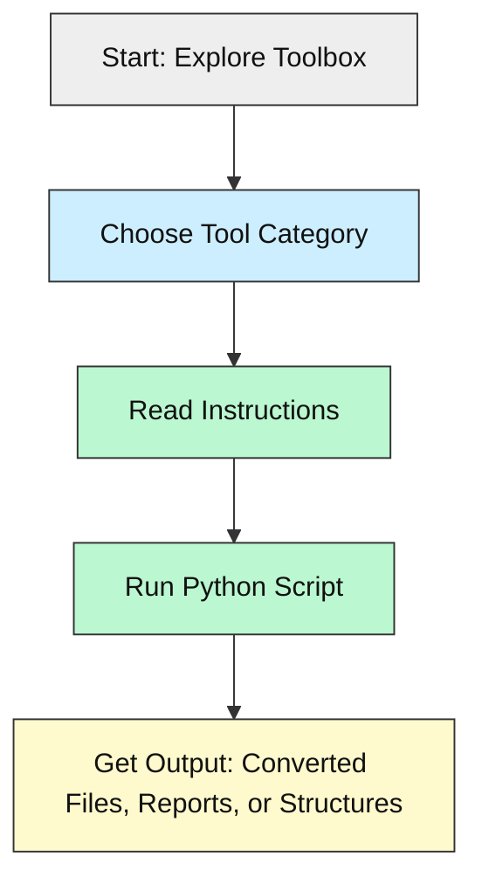
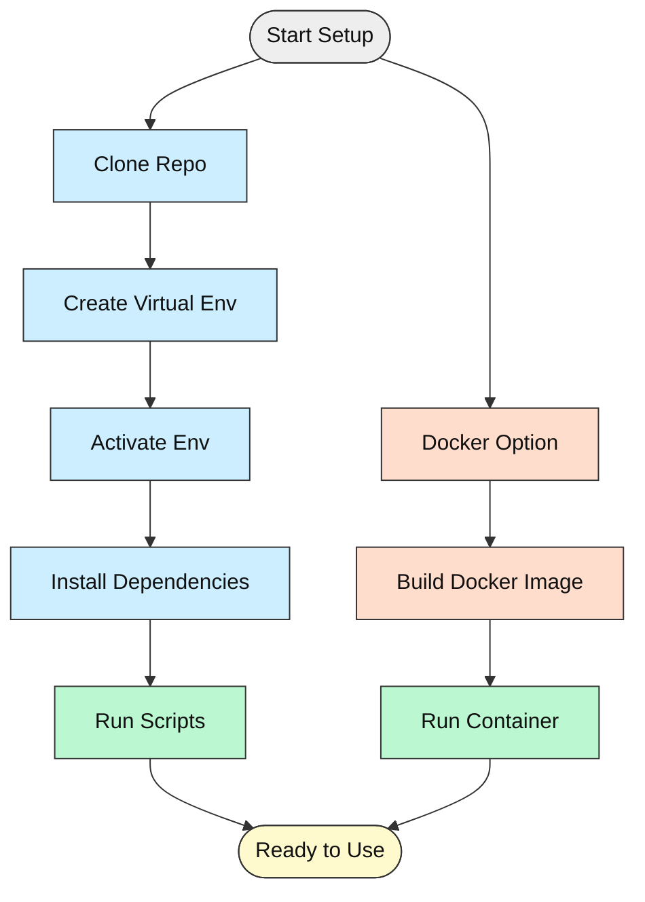

# CluelessCodersToolbox

[](LICENSE.md)


---

## What is CluelessCodersToolbox?

CluelessCodersToolbox is a **beginner-friendly guide and toolset** designed to help novice coders confidently navigate codebases and GitHub. It offers essential best practices, clear setup instructions, and visual aids to make the coding process more accessible and enjoyable.

Whether you're a **natural language prompt engineer, coding newcomer, or casual contributor**, this toolbox aims to empower you with practical skills and confidence.

---

## Tech Stack 🧰

| Area            | Technologies                                  |
|-----------------|-----------------------------------------------|
| **Languages**   | Python 3.12+                                 |
| **Tools**       | Git, GitHub                                  |
| **Dependencies**| See individual `requirements.txt` files      |
| **Platforms**   | Windows, Linux, macOS                        |

---

## Key Features ✨

- Beginner-friendly explanations and instructions
- Visual guides and diagrams
- Example `.gitignore` template
- Modular tools for audio, document conversion, repo analysis, and more
- Clear folder structure for easy navigation
- Designed to reduce overwhelm and build confidence

---

## Project Structure

```markdown
CluelessCodersToolbox/
│
├── .gitignore                         # Example gitignore template
├── license.md                        # License information
├── changelog.txt                     # Project changelog
├── README.md                         # Main repo guide (this file)
│
├── Audio-File-Tools/                 # Audio conversion/compression tools
│   ├── *.py, README.md, requirements.txt
│
├── Document-Format-Converters/       # PDF/Image/Markdown converters
│   ├── *.py, README.md, requirements.txt
│
├── File-and-Folder-Structure/        # Scripts for managing file structures
│   ├── *.py, README.md
│
├── Repo-Analyzer/                    # Repository analysis tools
│   ├── *.py, README.md, requirements.txt
│
├── Template-gitignore/               # Gitignore templates
│
├── assets/
│   ├── images/, styles/, favicon.ico
│
├── README-best-practice-guidlines/   # This README guideline
```

---

## How It Works

The toolbox provides **modular, beginner-friendly scripts** to help you:

1. **Convert audio and documents** with simple Python scripts.
2. **Analyze repositories** to understand code structure.
3. **Manage file and folder structures** easily.
4. **Learn best practices** via clear examples and guides.



---

## Prerequisites

- **Python 3.12 or newer**: [Download Python](https://www.python.org/downloads/)
- **Git**: [Download Git](https://git-scm.com/downloads)
- (Optional) **Docker Desktop** if you prefer containerized setup, but beginners can skip this.

---

## Setup Options

### Option 1: Local Virtual Environment (Recommended)

1. **Clone the repository**

```bash
git clone https://github.com/yourusername/CluelessCodersToolbox.git
cd CluelessCodersToolbox
```

2. **Create a virtual environment**

```bash
python -m venv venv
```

3. **Activate the environment**

- **Windows:**

```bash
venv\Scripts\activate
```

- **macOS/Linux:**

```bash
source venv/bin/activate
```

4. **Install dependencies**

For each tool, navigate to its folder and run:

```bash
pip install -r requirements.txt
```

5. **Run the desired script**

```bash
python your_script.py
```

---

### Option 2: Docker (Optional, for advanced users)

- Ensure Docker Desktop is installed.
- Build and run containers as needed (Dockerfiles not yet provided).

---

## Visual Setup Guide



---

## Running the Project

- Activate your virtual environment.
- Navigate to the desired tool folder.
- Run the script, e.g.:

```bash
python Audio-file-compress-mono-mp3.py
```

- Follow any tool-specific README instructions.

---

## Configuration & API Keys

Currently, no API keys are required. If future tools require them, instructions will be added here.

---

## Project Status & Roadmap 🚦

- ✅ Core tools for audio and document conversion
- ✅ Beginner-friendly folder structure
- ✅ Basic repo analysis scripts
- ⏳ More detailed tutorials and examples
- 🔜 Docker support and automation scripts
- 🔜 Enhanced visual guides and flowcharts

---

## How AI Helped 🤖✨

- Assisted in drafting documentation and best practices
- Helped design beginner-friendly explanations
- Accelerated code review and refactoring

---

## License 📜

This project is licensed under the [MIT License](license.md).

---

## Community & Feedback 🙌

- New to coding? **You are welcome here!**
- Found a bug or have a question? **Open an issue or discussion on GitHub.**
- Contributions, suggestions, and feedback are highly encouraged.

---

_Empowering new coders with clarity, confidence, and community._
