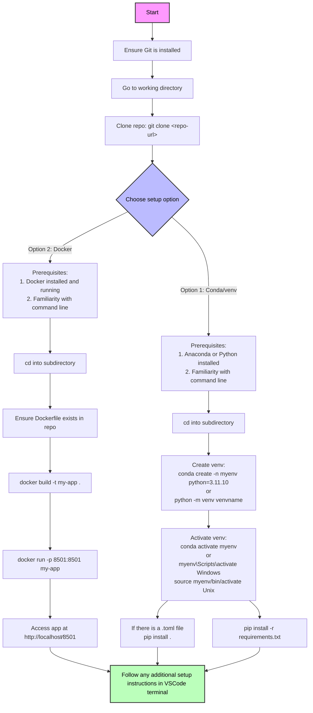

# CluelessCodersPlaybook
For novices, the CluelessCodersPlaybook is a beginner-friendly guide offering essential best practices, straightforward setup instructions, and visual aids to help novice coders navigate coding and GitHub with confidence. This playbook is your go-to resource for making coding accessible and enjoyable!

### Clueless Coder Documentation Standard Outline

#### 1. Introduction
- **Purpose**: Briefly explain the goal of the repository and its primary functionality.
- **Target Audience**: Specify that this is aimed at users with little to no coding experience.

#### 2. Reasons for Fork/Contribution
- Clearly state what improvements have been made compared to the original repository (e.g., frozen dependencies, clearer documentation).

#### 3. Prerequisites
- List necessary tools and versions (e.g., Python version, any required accounts).
- Provide installation links or instructions for these tools.

#### 4. Quick Start Guide
- **Time Limit**: If users cannot get started within 15 minutes, suggest alternative options (e.g., using a web service).
- **Setup Options**: Clearly outline multiple ways to set up the project based on the user's familiarity with virtual environments or tools.
  - **Option 1**: Using `venv` or `conda`
  - **Option 2**: Using Docker (with a clear warning for novices)

#### 5. Important Notices
- Include any non-standard practices or file renaming needed for familiarity and ease of use.
- Mention any specific files that contain default settings or configurations.

#### 6. Visual Aid
- Present a flowchart or mind map that visually represents the steps to set up and run the project. This will help users quickly grasp the process.

##### Example

#### 7. Running the Code
- Provide a concise command sequence for running the application, ensuring that even novice users can simply copy and paste.

#### 8. Setting API Keys (if applicable)
- If API keys are required, explain how they are obtained or configured in a straightforward manner.

### Conclusion
- *Call to Action* - Encourage users to provide feedback or ask questions as they work through the repository, fostering a supportive community around the project.

---
