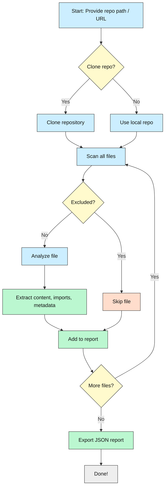
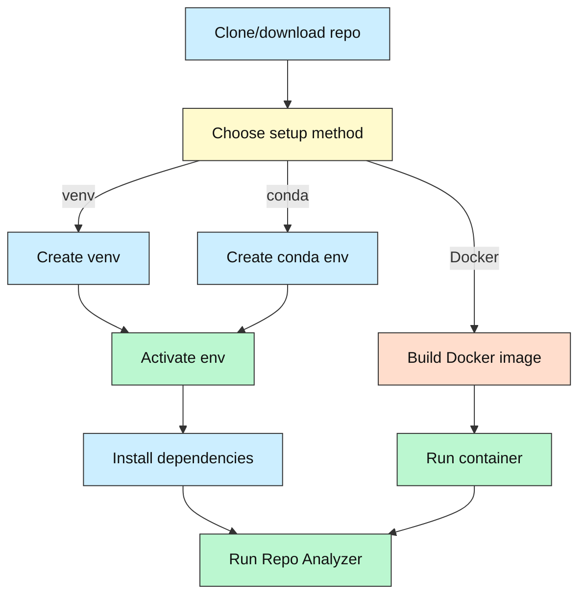

# 🧠 **Repo Analyzer: Instantly Understand Any Codebase**

[](LICENSE)


---

## 🌟 What is Repo Analyzer? *Why should you care?*

Ever felt **lost in a giant codebase**? Or wanted a **quick, clean summary** of a project *without* digging through endless files?

**Repo Analyzer** is your **friendly robot assistant** that:

- **Clones or scans** any Git repository (local or remote)
- **Skips the junk**: binaries, media, clutter, and noise
- **Extracts code, imports, and metadata**
- **Exports a beginner-friendly JSON snapshot** of the entire repo

Perfect for **prompt engineers, coding newcomers, or casual contributors** who want to **understand, document, or improve** any repo — **without getting overwhelmed**.

---

## 🧰 Tech Stack Overview

| Area             | Technologies / Tools                          |
|------------------|----------------------------------------------|
| **Language**     | Python 3.7+                                 |
| **Libraries**    | `gitpython`, `pathlib`, `logging`, `json`   |
| **Storage**      | Local JSON export                           |
| **CLI**          | Interactive command-line prompts            |
| **Output**       | Timestamped `.json` files in `.Repo-Analyzer-Output` |

---

## ✨ Key Features

- 🌀 **Clone or analyze** any Git repo (local or remote URL)
- 🧹 **Skips** binaries, media, archives, and common clutter
- 🕵️ **Extracts**:
  - File paths, sizes, extensions
  - Code content (text files only)
  - Import statements (Python)
  - Metadata (last modified time)
- 🗂️ **Organizes** by directory and file type
- 📦 **Exports** a timestamped JSON report
- 📝 **Beginner-friendly CLI prompts**
- 🔍 **Ideal for prepping repos for LLM analysis**

---

## 🧩 How It Works: Under the Hood

**In simple steps:**

1. **Input**: You provide a **local repo path** (and optionally a **Git URL** to clone).
2. **Clone (optional)**: If URL is given, it clones the repo.
3. **Scan**: Recursively walks all files.
4. **Filter**: Skips excluded extensions & folders.
5. **Analyze**:
   - Reads text files
   - Extracts imports (Python)
   - Gathers metadata
6. **Export**: Saves a **timestamped JSON** report inside `.Repo-Analyzer-Output`.

---

## 🔄 Workflow Diagram



---

## 🛠️ Prerequisites

| Tool            | Why Needed                                         | Download Link                                         |
|-----------------|----------------------------------------------------|-------------------------------------------------------|
| **Python 3.7+** | Runs the analyzer                                 | [python.org](https://www.python.org/downloads/)       |
| **Git**         | To clone remote repositories                       | [git-scm.com](https://git-scm.com/downloads)          |
| **pip**         | To install Python packages                         | Comes with Python                                     |
| **(Optional)** `conda` | Alternative environment manager            | [miniconda](https://docs.conda.io/en/latest/miniconda.html) |

_No API keys required!_

---

## ⚙️ Setup Options (Choose One)

### 🥇 Option 1: Virtual Environment (Recommended for Beginners)

```bash
# Clone the repo (or download ZIP)
git clone https://github.com/yourname/repo-analyzer.git
cd repo-analyzer

# Create virtual environment
python -m venv repo_env

# Activate it
# Windows:
repo_env\Scripts\activate
# macOS/Linux:
source repo_env/bin/activate

# Install dependencies
pip install -r requirements.txt
```

### 🥈 Option 2: Conda Environment

```bash
conda create -n repo_env python=3.9
conda activate repo_env
pip install -r requirements.txt
```

### 🥉 Option 3: Docker (Optional, Not Recommended for Beginners)

> ⚠️ **Note:** Docker adds complexity. Beginners may skip this.

```bash
# Build Docker image
docker build -t repo-analyzer .

# Run container
docker run -it --rm -v /path/to/your/repos:/repos repo-analyzer
```

---

## 🗺️ Visual Setup Guide



---

## ▶️ Running Repo Analyzer

After setup, run:

```bash
python Repo-Analyzer-main01.py
```

You'll be prompted to:

- Enter a **repository URL** (press Enter to skip if analyzing local repo)
- Enter the **local repository path**

The tool will:

- Clone (if URL given)
- Analyze the repo
- Export a JSON report inside `.Repo-Analyzer-Output`

---

## 🔑 Configuration & API Keys

- **No API keys required!**
- Just provide a **repo URL** (optional) and **local path**.
- Output saved automatically in `.Repo-Analyzer-Output`.

---

## 📊 Project Status & Roadmap

- ✅ Clone and analyze Git repos
- ✅ Skip binaries/media
- ✅ Extract imports & metadata
- ✅ Export JSON reports
- ⏳ Improve language support (non-Python)
- ⏳ Add more visualizations
- 🔜 Web UI for easier use
- 🔜 Integration with LLMs for auto-docs
- ⚠️ Known: Large repos may take time

---

## 🤖 How AI Helped Build This

- AI pair programmers helped design filtering logic
- Assisted in writing docstrings and error handling
- Inspired this beginner-friendly README!

---

## 📜 License

This project is licensed under the [MIT License](LICENSE).

---

## 💬 Community & Support

- **New to coding?** You’re welcome here!
- Open issues or questions on GitHub
- Suggest features or improvements
- Share your experience to help others!

---

# 🧭 _Navigate any codebase with confidence!_
