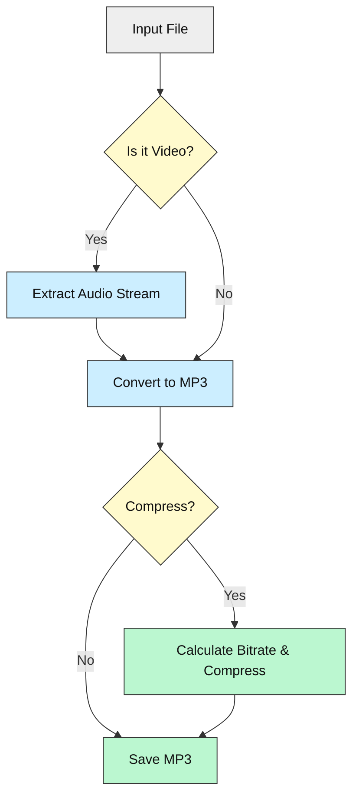
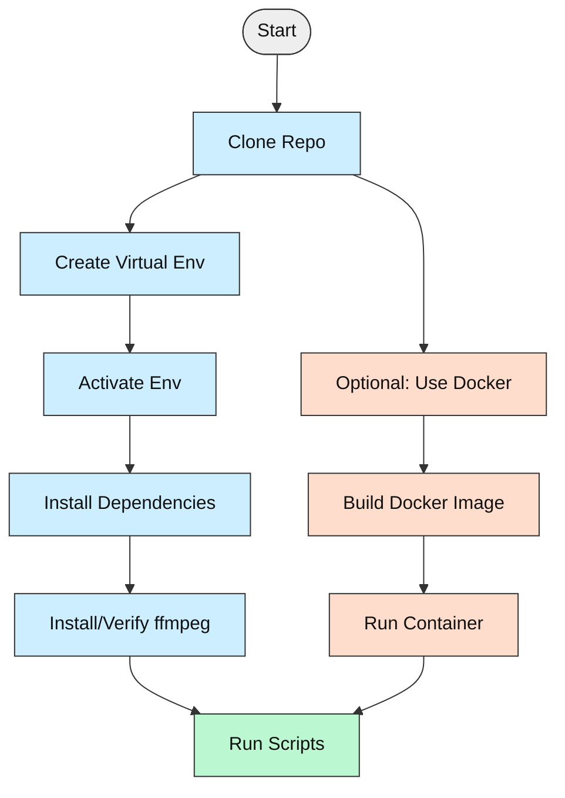

# 🎵 **Audio File Toolbox** — Convert, Extract, Compress with Ease!

[](https://opensource.org/licenses/MIT)


---

## 🎯 What is Audio File Toolbox?

**Audio File Toolbox** is a beginner-friendly set of Python scripts that help you:

- **Convert** any audio file to MP3
- **Extract** audio from video files
- **Compress** audio files to a manageable size (≤10MB)

Think of it as your **Swiss Army knife** for audio files — no complex software, just simple tools powered by [ffmpeg](https://ffmpeg.org/).

Perfect for **content creators, students, podcasters, or anyone** who wants to handle audio files **without hassle**.

---

## 🧰 Tech Stack Overview

| Component       | Details                                         |
|-----------------|-------------------------------------------------|
| **Language**    | Python 3.7+                                     |
| **Core Tool**   | [ffmpeg](https://ffmpeg.org/) (required)        |
| **Python libs** | Standard library only                           |
| **Packaging**   | `setuptools`, `wheel` (build tools only)        |
| **Platforms**   | Windows, Linux, macOS                           |

*No complex dependencies. Just Python + ffmpeg.*

---

## ✨ Key Features

- 🎵 Convert any audio format to MP3
- 🎥 Extract audio from video files (MP4, AVI, MKV, etc.)
- 📦 Compress audio to mono MP3 targeting ≤10MB size
- 🖥️ Cross-platform: works on Windows, Linux, macOS
- 🛠️ Minimal setup, beginner-friendly scripts
- 🔍 Uses `ffmpeg` under the hood for powerful processing

<details>
<summary>📁 <strong>Project Structure</strong></summary>

```plaintext
Audio-File-Tools/
├── Audio-file-to-mp3.py            # Convert audio to MP3
├── Extract-audio-to-mp3.py         # Extract audio from video to MP3
├── Audio-file-compress-mono-mp3.py # Compress audio to mono MP3 ≤10MB
├── requirements.txt                # Build tools (setuptools, wheel)
└── README.md                       # This guide
```
</details>

---

## ⚙️ How It Works

### Step-by-step:

1. **Provide an input file** (audio or video)
2. **Choose a script**:
   - Convert audio to MP3
   - Extract audio from video
   - Compress audio to mono MP3 ≤10MB
3. **Script calls `ffmpeg`** to process the file
4. **Get your MP3 output!**

### Workflow Diagram



---

## 🛠️ Prerequisites

| Tool            | Why Needed                                         | How to Get It                                         |
|-----------------|----------------------------------------------------|-------------------------------------------------------|
| **Python 3.7+** | Run the scripts                                   | [Download Python](https://www.python.org/downloads/)  |
| **ffmpeg**      | Audio/video processing backend                    | [Download FFmpeg](https://ffmpeg.org/download.html)   |
| **pip**         | Install Python packages (optional)                | Comes with Python                                     |
| **Git**         | (Optional) Clone the repo                         | [Download Git](https://git-scm.com/downloads)         |

> ⚠️ **Note:** No API keys or accounts required!

---

## 🚀 Setup Options

### 🟢 Option 1: Virtual Environment (Recommended)

1. **Clone the repo**

```bash
git clone https://github.com/yourusername/CluelessCodersToolbox.git
cd CluelessCodersToolbox/tools/Audio-File-Tools
```

2. **Create a virtual environment**

```bash
python -m venv venv
```

3. **Activate it**

- **Windows:**

```bash
venv\Scripts\activate
```

- **macOS/Linux:**

```bash
source venv/bin/activate
```

4. **Install build tools (optional)**

```bash
pip install -r requirements.txt
```

5. **Verify ffmpeg is installed**

```bash
ffmpeg -version
```

If not, [download and install ffmpeg](https://ffmpeg.org/download.html).

---

### 🟠 Option 2: Docker (Advanced, Optional)

> ⚠️ **Docker is NOT recommended for beginners.** It adds complexity.

1. **Install Docker Desktop**: [Get Docker](https://www.docker.com/products/docker-desktop/)

2. **Build the image**

```bash
docker build -t audio-tools .
```

3. **Run a container**

```bash
docker run -it -v /path/to/your/files:/data audio-tools
```

4. **Use `python` inside the container** to run scripts.

---

## 🗺️ Visual Setup Guide



---

## ▶️ Running the Tools

Run any script with:

```bash
python Audio-file-to-mp3.py
python Extract-audio-to-mp3.py
python Audio-file-compress-mono-mp3.py
```

- The **converter** script will prompt for an audio file and save as MP3.
- The **extractor** script will extract audio from video files.
- The **compressor** script will reduce file size to ≤10MB mono MP3.

---

## 🔑 Configuration & API Keys

No API keys or special configs needed! Just ensure `ffmpeg` is installed and in your PATH.

---

## 🚦 Status & Roadmap

- ✅ Basic audio conversion
- ✅ Audio extraction from video
- ✅ Compression targeting ≤10MB
- ⏳ Batch processing support (planned)
- ⏳ GUI wrapper (planned)
- ⚠️ No error handling for corrupt files yet
- 🔜 Drag-and-drop interface

---

## 🤖 How AI Helped

This README was generated with the help of an AI coding assistant to ensure clarity, accessibility, and beginner-friendliness.

---

## 📜 License

This project is licensed under the [MIT License](../../LICENSE.md).

---

## 💬 Community & Feedback

- **Questions?** Open an issue or discussion on GitHub.
- **Feedback?** Contributions welcome!
- **Beginners encouraged** — no question is too small.

---

_Empowering everyone to handle audio files with confidence!_
