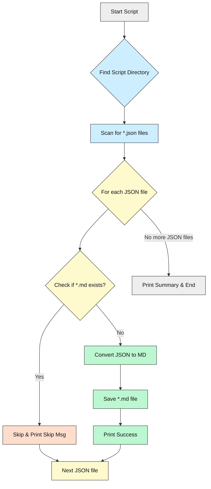
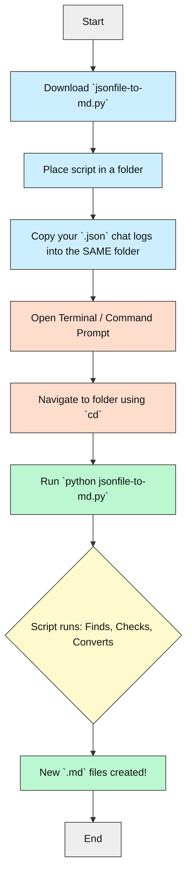

# JSON Conversation to Markdown Converter

[](../../LICENSE.md)


**Turn your AI chat logs (in specific JSON formats) into readable Markdown files automatically.**

---

## What is this? 🤔

Have you ever saved chat conversations from AI tools like ChatGPT, Claude, or others as JSON files? This script helps you convert those JSON logs into clean, easy-to-read Markdown (`.md`) files.

It's designed for anyone who wants to quickly archive or review their AI interactions without digging through complex JSON structures. Think of it as an automatic transcriber for your AI chats!

---

## Tech Stack 🛠️

| Area          | Technologies           | Notes                                    |
|---------------|------------------------|------------------------------------------|
| **Language**  | Python                 | Version 3.7 or higher recommended        |
| **Libraries** | `json` (built-in)      | For reading the JSON input               |
|               | `pathlib` (built-in)   | For handling file paths across OS        |

*(No external packages needed!)*

---

## Key Features ✨

- **Automatic Discovery:** Scans the script's directory for `.json` files.
- **Selective Conversion:** Only converts JSON files that don't already have a corresponding `.md` file.
- **Format Compatibility:** Handles two common JSON structures:
    - Flat structure with top-level `model`, `settings`, `messages`.
    - Nested structure with `model` at the top-level and `messages`/`settings` inside a `payload` object.
- **Readable Output:** Creates Markdown files with:
    - Conversation title (using the model name)
    - Model settings listed clearly
    - Clearly labeled `USER`, `ASSISTANT`, and `SYSTEM` messages
    - Horizontal rules (`---`) separating messages
    - Handles both string-based and list-based message content.
- **Simple Naming:** Output `.md` file uses the same name as the input `.json` file (e.g., `chat_log.json` -> `chat_log.md`).
- **UTF-8 Support:** Reads and writes files using UTF-8 encoding for broad character compatibility.
- **Clear Console Output:** Prints which files are being processed, skipped, or encountered errors.

---

## How It Works ⚙️➡️📄

The script follows these simple steps when you run it:

1.  **Find Script Location:** Determines the directory where the `jsonfile-to-md.py` script itself is located.
2.  **Scan for JSON:** Looks for any files ending with `.json` in that same directory.
3.  **Check for Markdown:** For each `.json` file found, it checks if a file with the *same name* but ending in `.md` already exists in the directory.
4.  **Convert if Needed:** If *no* corresponding `.md` file exists, it proceeds to convert the `.json` file.
5.  **Parse JSON:** Reads the `.json` file, intelligently checking for either the flat or nested (`payload`) structure to find the conversation details (model, settings, messages).
6.  **Format Markdown:** Structures the extracted information into a readable Markdown format, labeling messages by role (User, Assistant, System).
7.  **Save Markdown:** Writes the formatted content to a new `.md` file with the same name as the original JSON file.
8.  **Report:** Prints messages to the console indicating which files were converted, skipped, or if any errors occurred.

### Workflow Diagram



---

## Prerequisites 📋

- **Python:** You need Python installed on your system. Version 3.7 or newer is recommended as it includes `pathlib`.
    - [Download Python](https://www.python.org/downloads/)
- **JSON Files:** You need one or more JSON files (saved from AI chat tools) in the format the script expects. Place them in the **same directory** as the `jsonfile-to-md.py` script.

---

## Setup & Running ⚡️

This script is designed to be super simple!

1.  **Download:** Save the `jsonfile-to-md.py` script file to a folder on your computer.
2.  **Add JSONs:** Copy or save your JSON chat log files into that **same folder**.
3.  **Run from Terminal:**
    *   Open your terminal or command prompt (like Command Prompt on Windows, Terminal on macOS/Linux).
    *   Navigate to the folder where you saved the script and JSON files using the `cd` command. For example:
        ```bash
        cd C:\Users\YourName\Documents\AI_Chat_Converter
        ```
        (Replace the path with your actual folder path)
    *   Run the script using Python:
        ```bash
        python jsonfile-to-md.py
        ```

That's it! The script will automatically find the JSON files, convert the ones without corresponding Markdown files, and print its progress. Your new `.md` files will appear in the same folder.

### Visual Setup Guide



---

## Configuration

There's **no configuration needed** for this script! It works based on the files present in its directory.

---

## Status & Roadmap 🚦

- ✅ Automatic JSON discovery in the script's directory.
- ✅ Conversion of JSON to Markdown if Markdown doesn't exist.
- ✅ Handles two common JSON structures (flat and nested `payload`).
- ✅ Creates readable Markdown output with roles and settings.
- ✅ Skips already converted files.
- ✅ Basic error handling during conversion.
- ⏳ *No planned features currently.* This is a simple utility script.
- ⚠️ Potential issues if JSON files are malformed or don't match expected structures.
- ⚠️ Does not handle very large files efficiently (reads the whole file).

---

## How AI Helped 🤖✨

This script, including its refinements to handle different JSON structures and the creation of this README, was developed iteratively with the help of an AI assistant (Gemini 2.5 Pro via Cursor).

- **Initial Scripting:** AI helped draft the basic file reading and conversion logic.
- **Debugging:** When the script failed on a new JSON format, AI helped analyze the structure and modify the code to handle nested payloads and different content types.
- **Documentation:** AI generated this README based on specific guidelines, including creating the Mermaid diagrams to explain the workflow visually.

Using AI significantly sped up development, improved error handling, and made creating comprehensive documentation much easier!

---

## License 📜

This project is licensed under the MIT License. See the [LICENSE](../../LICENSE.md) file for details.

---

## Support & Feedback 🙌

This is a simple utility, but if you encounter issues with specific JSON files (that match the described structures) or have suggestions:

- Feel free to raise an Issue if this is in a Git repository.
- Or, just modify the script yourself! It's straightforward Python.

Happy Converting! 
